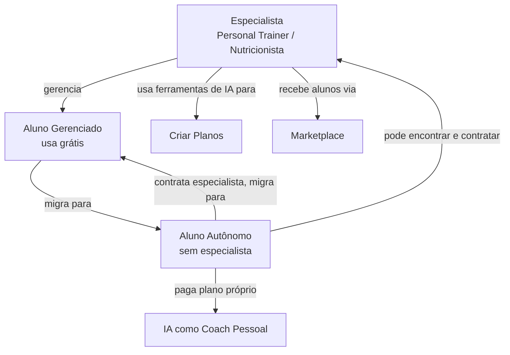
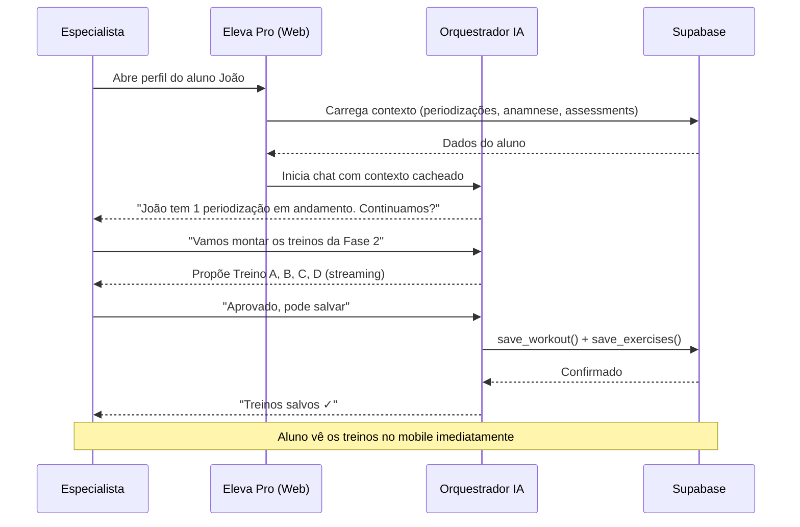
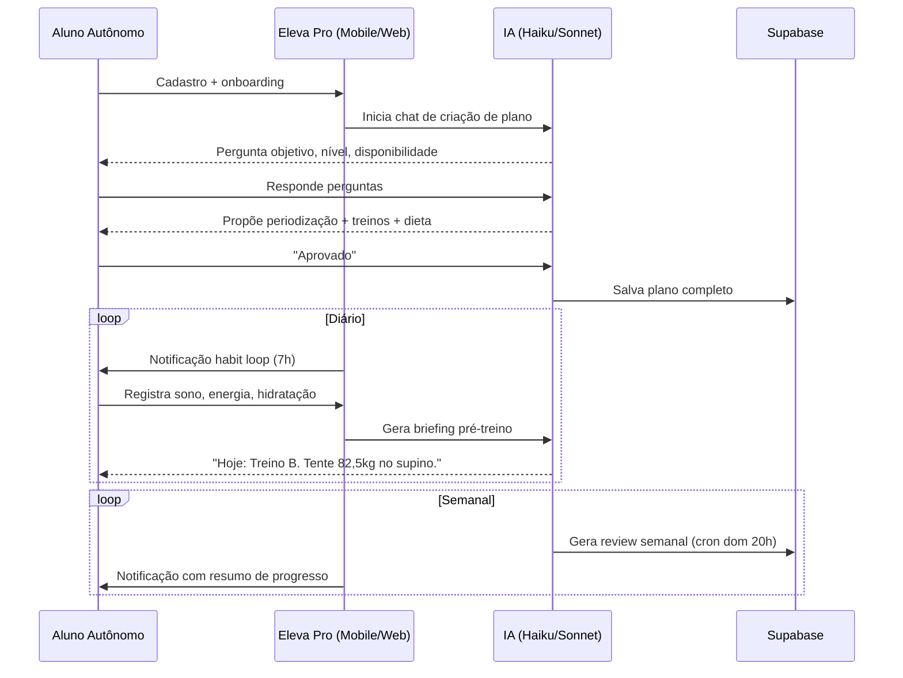
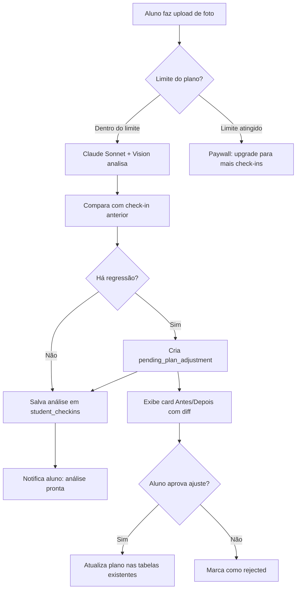
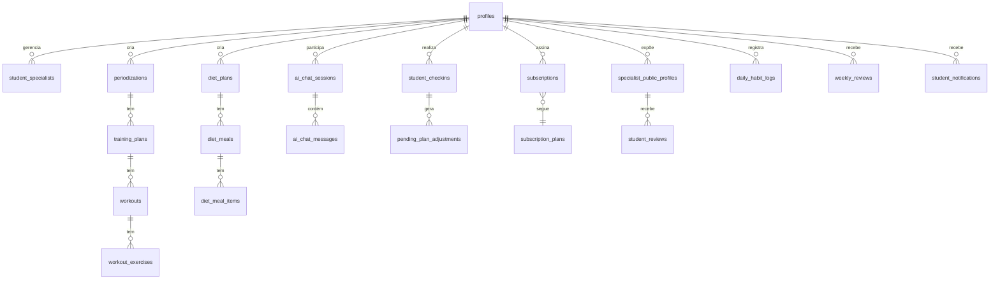

# Eleva Pro — Documentação Central

> **Ponto de entrada único.** Tudo sobre o produto, arquitetura e módulos está aqui ou linkado daqui.
> Atualizado em: 2026-04-19

---

## O que é o Eleva Pro

Plataforma SaaS de gestão de saúde e performance assistida por IA, para três públicos:



### Modelo de negócio

| Quem | Paga | Recebe |
|---|---|---|
| **Especialista** | R$89–199/mês | Plataforma completa + alunos gerenciados gratuitos |
| **Aluno Autônomo** | R$0–39/mês | IA como coach pessoal |
| **Aluno Gerenciado** | Grátis | Acompanhamento do especialista via plataforma |

---

## Arquitetura do sistema

```mermaid
graph TB
    subgraph Clientes
        MOB[Mobile - Expo<br/>Alunos + Especialistas]
        WEB[Web - Next.js<br/>Especialistas primário]
    end

    subgraph BFF [BFF - Next.js API Routes]
        API_AI[/api/ai/*<br/>Orquestradores de IA]
        API_STU[/api/students/*<br/>Gestão de alunos]
        API_BILL[/api/billing/*<br/>Assinaturas]
        API_WH[/api/webhooks/*<br/>Stripe · Asaas · Meta]
    end

    subgraph Serviços Externos
        ANT[Anthropic API<br/>Claude Sonnet + Haiku]
        SUP[Supabase<br/>PostgreSQL · Auth · Storage]
        STR[Stripe / Asaas<br/>Pagamentos]
        META[Meta Business API<br/>WhatsApp]
        EXPO[Expo Notifications<br/>Push Mobile]
    end

    MOB -->|JWT Bearer| BFF
    WEB -->|Cookie Session| BFF
    BFF --> ANT
    BFF --> SUP
    BFF --> STR
    BFF --> META
    BFF --> EXPO
```

### Regra crítica
**Mobile nunca chama Anthropic diretamente** — API key ficaria exposta. Toda IA passa pelo BFF.

---

## Módulos do produto

```mermaid
graph LR
    subgraph Implementado ✅
        AUTH[Auth]
        STU[Alunos]
        WRK[Treinos]
        NUT[Nutrição]
        GAME[Gamificação]
        ASSESS[Avaliação Física]
    end

    subgraph Em Construção 🔨
        AI_CHAT[AI Coach Chat<br/>Especialista + IA]
        DASH[Dashboard<br/>Especialista Web]
    end

    subgraph Roadmap 📋
        AI_STU[AI Aluno Autônomo]
        ENG[Engagement Loop<br/>Briefing · Habit Loop]
        BILL[Billing]
        MARKET[Marketplace]
        ADMIN[Admin Panel]
        WHATS[Alertas WhatsApp]
    end
```

### Status detalhado

| Módulo | Status | PRD | Branch |
|---|---|---|---|
| Auth | ✅ Implementado | — | — |
| Gestão de Alunos | ✅ Implementado | — | — |
| Treinos (mobile + web) | ✅ Implementado | — | — |
| Nutrição (mobile + web) | ✅ Implementado | — | — |
| Gamificação | ✅ Implementado | — | — |
| Avaliação Física | ✅ Implementado | — | — |
| AI Coach Chat | 🔨 PRD aprovado | [PRD](PRDs/ai/ai-coach-chat.md) | `feature/ai-coach-chat` |
| AI Aluno Autônomo | 🔨 PRD aprovado | [PRD](PRDs/ai/ai-student-autonomous.md) | — |
| Engagement Loop | 📋 Draft | [PRD](PRDs/product/engagement-loop.md) | — |
| Billing | 📋 Draft | [PRD](PRDs/product/billing.md) | — |
| Specialist Dashboard | 📋 Draft | [PRD](PRDs/product/specialist-dashboard.md) | — |
| Admin Panel | 📋 Draft | [PRD](PRDs/product/admin-panel.md) | — |
| AI Pricing (gates) | 📋 Draft | [PRD](PRDs/ai/ai-pricing.md) | — |
| AI Specialist Engagement | 📋 Draft | [PRD](PRDs/ai/ai-specialist-engagement.md) | — |
| Marketplace | 📋 Draft | [PRD](PRDs/ai/ai-marketplace.md) | — |

---

## Fluxo principal — Especialista



---

## Fluxo principal — Aluno Autônomo



---

## Fluxo de check-in com IA



---

## Schema do banco — visão geral



---

## Monorepo — onde cada tipo de código vive

```
/app                          Mobile (Expo + React Native)
  src/modules/<feature>/      feature isolada
    components/               UI do módulo
    screens/                  telas
    hooks/                    custom hooks
    store/                    Zustand store
    services/                 ← NÃO usar direto, ir para /shared

/web                          Dashboard Web (Next.js)
  src/app/                    App Router
    api/ai/                   ← TODO código de IA vive aqui
    api/billing/              integrações de pagamento
    api/webhooks/             Stripe, Asaas, Meta
    dashboard/                páginas do dashboard
  src/modules/<feature>/      feature isolada (mesma estrutura)

/shared                       Código compartilhado mobile + web
  src/services/               ← TODA query Supabase vai aqui
  src/types/                  tipos TypeScript compartilhados

/supabase
  migrations/                 migrations SQL em ordem numérica
```

---

## Modelos de IA por função

| Função | Modelo | Custo relativo |
|---|---|---|
| Orquestrador (chat treino/nutrição) | Claude Sonnet 4.6 | ●●●●○ |
| Análise de foto (check-in) | Claude Sonnet 4.6 + Vision | ●●●●○ |
| Assistente diário, briefing, review | Claude Haiku 4.5 | ●○○○○ |
| Sub-agentes (gerar JSON estruturado) | Claude Haiku 4.5 | ●○○○○ |

**Custo estimado de IA por aluno/mês: R$0,65–1,12** (com prompt caching agressivo).

---

## Documentação técnica por módulo

Cada módulo tem seu próprio documento com **C4 Nível 3**, diagramas de fluxo, state diagrams e endpoints. Entre aqui para entender como um módulo funciona internamente.

| Módulo | Documento | Status |
|---|---|---|
| **IA** | [modules/ai/README.md](modules/ai/README.md) | ✅ Documentado |
| Treinos | [modules/workouts/README.md](modules/workouts/README.md) | 🔲 A fazer |
| Nutrição | [modules/nutrition/README.md](modules/nutrition/README.md) | 🔲 A fazer |
| Alunos | [modules/students/README.md](modules/students/README.md) | 🔲 A fazer |
| Billing | [modules/billing/README.md](modules/billing/README.md) | 🔲 A fazer |
| Engagement | [modules/engagement/README.md](modules/engagement/README.md) | 🔲 A fazer |
| Marketplace | [modules/marketplace/README.md](modules/marketplace/README.md) | 🔲 A fazer |
| Admin | [modules/admin/README.md](modules/admin/README.md) | 🔲 A fazer |

> Template para novos módulos: [modules/_template.md](modules/_template.md)

---

## Documentos de referência

| Documento | Propósito |
|---|---|
| [STATUS.md](STATUS.md) | Status atual de todos os módulos — atualizar ao fechar PR |
| [SYSTEM_MAPPING.md](SYSTEM_MAPPING.md) | Schema canônico, decisões de arquitetura, anti-padrões |
| [HOW_WE_WORK.md](HOW_WE_WORK.md) | Fluxo de desenvolvimento, scripts, hooks |
| [LGPD_COMPLIANCE.md](LGPD_COMPLIANCE.md) | Regras de privacidade e dados de saúde |
| [GLOSSARY.md](GLOSSARY.md) | Termos canônicos do domínio |
| [PRDs/README.md](PRDs/README.md) | Índice de todos os PRDs com ordem de implementação |
| [PRDs/product/branding.md](PRDs/product/branding.md) | Identidade visual Eleva Pro |
| [decisions/](decisions/) | ADRs — decisões arquiteturais registradas |
