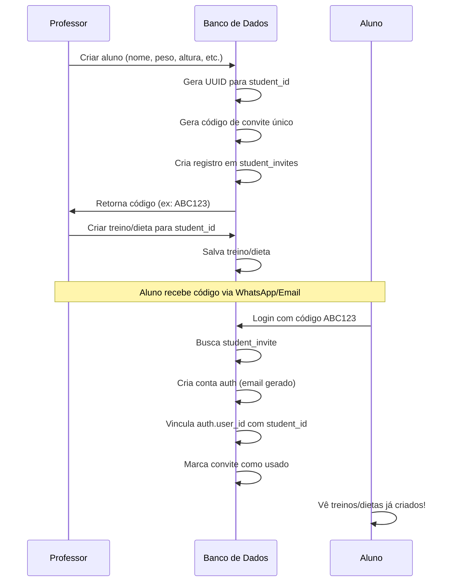

# Sistema de Controle de Acesso Multi-Perfil - MeuPersonal

## 1. Visão Geral

O sistema agora suporta **múltiplos perfis profissionais** que podem trabalhar com o mesmo aluno de forma independente ou colaborativa:

- 🏋️ **Personal Trainer** (Treino)
- 🥗 **Nutricionista** (Dieta)
- 💪 **Híbrido** (Treino + Dieta)
- 👤 **Aluno** (Acesso via código)

---

## 2. Perfis de Usuário

### 2.1. Personal Trainer (Treino)
**Especialização:** Treinos e exercícios físicos

**Permissões:**
- ✅ Criar/editar/excluir treinos
- ✅ Visualizar progresso de treinos
- ✅ Convidar alunos (gera código)
- ✅ Criar aluno antecipadamente (NOVO)
- ❌ **NÃO** pode criar/editar dietas

**Acesso:**
- Login via email/senha
- Vê apenas seus próprios alunos

---

### 2.2. Nutricionista (Dieta)
**Especialização:** Nutrição e dietas

**Permissões:**
- ✅ Criar/editar/excluir dietas
- ✅ Visualizar progresso nutricional
- ✅ Convidar alunos (gera código)
- ✅ Criar aluno antecipadamente (NOVO)
- ❌ **NÃO** pode criar/editar treinos

**Acesso:**
- Login via email/senha
- Vê apenas seus próprios alunos

---

### 2.3. Híbrido (Treino + Dieta)
**Especialização:** Ambas as áreas

**Permissões:**
- ✅ Criar/editar/excluir treinos
- ✅ Criar/editar/excluir dietas
- ✅ Visualizar todo o progresso
- ✅ Convidar alunos (gera código)
- ✅ Criar aluno antecipadamente (NOVO)

**Acesso:**
- Login via email/senha
- Vê apenas seus próprios alunos

---

### 2.4. Aluno
**Acesso:** Via código de convite

**Permissões:**
- ✅ Visualizar treinos e dietas atribuídos
- ✅ Marcar refeições/treinos como concluídos
- ✅ Registrar feedback
- ✅ Editar perfil básico (foto, peso, altura)
- ❌ **NÃO** pode criar treinos/dietas

---

## 3. Relacionamento Aluno ↔ Profissionais

### 3.1. Modelo de Dados

```typescript
// Tabela: profiles
interface Profile {
  id: string;
  email: string;
  full_name: string;
  role: 'personal' | 'nutritionist' | 'hybrid' | 'student';
  specialization?: 'workout' | 'nutrition' | 'both'; // Para profissionais
  // ...
}

// Tabela: students_professionals (NOVA)
interface StudentProfessional {
  id: string;
  student_id: string; // FK -> profiles(id)
  professional_id: string; // FK -> profiles(id)
  professional_type: 'personal' | 'nutritionist' | 'hybrid';
  status: 'active' | 'inactive';
  created_at: string;
}
```

### 3.2. Cenários de Relacionamento

#### Cenário 1: Aluno com Personal Trainer
```
Aluno João
  └─ Personal Trainer: Carlos (treino)
```

#### Cenário 2: Aluno com Nutricionista
```
Aluno Maria
  └─ Nutricionista: Ana (dieta)
```

#### Cenário 3: Aluno com Ambos (Profissionais Diferentes)
```
Aluno Pedro
  ├─ Personal Trainer: Carlos (treino)
  └─ Nutricionista: Ana (dieta)
```

#### Cenário 4: Aluno com Híbrido
```
Aluno Lucas
  └─ Híbrido: Roberto (treino + dieta)
```

---

## 4. Criação Antecipada de Alunos (NOVO)

### 4.1. Problema Atual
- Professor cria código de convite
- Aluno **só é criado** quando faz login
- Professor **não pode** criar treino/dieta antes do aluno logar

### 4.2. Nova Solução
- Professor cria o **aluno completo** imediatamente
- Sistema gera código de convite automaticamente
- Professor pode criar treino/dieta **antes** do aluno acessar
- Quando aluno faz login com código, **vincula** ao perfil existente

### 4.3. Fluxo Atualizado



---

## 5. Estrutura do Banco de Dados

### 5.1. Tabela `profiles` (Atualizada)

```sql
CREATE TABLE profiles (
  id UUID PRIMARY KEY REFERENCES auth.users(id),
  email TEXT UNIQUE,
  full_name TEXT,
  role TEXT NOT NULL CHECK (role IN ('personal', 'nutritionist', 'hybrid', 'student')),
  specialization TEXT CHECK (specialization IN ('workout', 'nutrition', 'both')),
  phone TEXT,
  weight DECIMAL,
  height DECIMAL,
  notes TEXT,
  invite_code TEXT UNIQUE, -- Para alunos
  created_at TIMESTAMPTZ DEFAULT NOW()
);
```

### 5.2. Tabela `student_invites` (Atualizada)

```sql
CREATE TABLE student_invites (
  id UUID PRIMARY KEY DEFAULT uuid_generate_v4(),
  professional_id UUID REFERENCES profiles(id) NOT NULL,
  student_id UUID UNIQUE, -- NOVO: Referência ao aluno pré-criado
  invite_code TEXT UNIQUE NOT NULL,
  name TEXT NOT NULL,
  phone TEXT,
  weight DECIMAL,
  height DECIMAL,
  notes TEXT,
  status TEXT DEFAULT 'pending' CHECK (status IN ('pending', 'accepted', 'expired')),
  created_at TIMESTAMPTZ DEFAULT NOW(),
  expires_at TIMESTAMPTZ,
  used_at TIMESTAMPTZ
);
```

### 5.3. Tabela `students_professionals` (NOVA)

```sql
CREATE TABLE students_professionals (
  id UUID PRIMARY KEY DEFAULT uuid_generate_v4(),
  student_id UUID REFERENCES profiles(id) NOT NULL,
  professional_id UUID REFERENCES profiles(id) NOT NULL,
  professional_type TEXT NOT NULL CHECK (professional_type IN ('personal', 'nutritionist', 'hybrid')),
  status TEXT DEFAULT 'active' CHECK (status IN ('active', 'inactive')),
  created_at TIMESTAMPTZ DEFAULT NOW(),
  UNIQUE(student_id, professional_id)
);

-- Índices
CREATE INDEX idx_students_professionals_student ON students_professionals(student_id);
CREATE INDEX idx_students_professionals_professional ON students_professionals(professional_id);
```

---

## 6. Controle de Acesso (RLS - Row Level Security)

### 6.1. Política para `diet_plans`

```sql
-- Nutricionista ou Híbrido pode ver/editar dietas dos seus alunos
CREATE POLICY "Professionals can manage their students' diets"
ON diet_plans
FOR ALL
USING (
  personal_id IN (
    SELECT professional_id 
    FROM students_professionals 
    WHERE student_id = diet_plans.student_id 
    AND professional_type IN ('nutritionist', 'hybrid')
    AND status = 'active'
  )
);

-- Aluno pode ver suas próprias dietas
CREATE POLICY "Students can view their own diets"
ON diet_plans
FOR SELECT
USING (student_id = auth.uid());
```

### 6.2. Política para `workout_plans`

```sql
-- Personal ou Híbrido pode ver/editar treinos dos seus alunos
CREATE POLICY "Professionals can manage their students' workouts"
ON workout_plans
FOR ALL
USING (
  personal_id IN (
    SELECT professional_id 
    FROM students_professionals 
    WHERE student_id = workout_plans.student_id 
    AND professional_type IN ('personal', 'hybrid')
    AND status = 'active'
  )
);

-- Aluno pode ver seus próprios treinos
CREATE POLICY "Students can view their own workouts"
ON workout_plans
FOR SELECT
USING (student_id = auth.uid());
```

---

## 7. Fluxo de Criação de Aluno (Passo a Passo)

### 7.1. Tela do Professor: "Adicionar Aluno"

```
┌─────────────────────────────────────┐
│  ← Adicionar Aluno                  │
│                                      │
│  Nome Completo *                    │
│  [João Silva____________]           │
│                                      │
│  Telefone                           │
│  [(11) 98765-4321_______]           │
│                                      │
│  Peso (kg)                          │
│  [75.5___________________]          │
│                                      │
│  Altura (cm)                        │
│  [175____________________]          │
│                                      │
│  Observações                        │
│  [Iniciante, sem lesões_]           │
│  [_______________________]          │
│                                      │
│  [  Criar Aluno e Gerar Código  ]  │
└─────────────────────────────────────┘
```

### 7.2. Backend: Função `createStudentWithInvite`

```typescript
// src/services/studentService.ts
export async function createStudentWithInvite(
  professionalId: string,
  studentData: {
    name: string;
    phone?: string;
    weight?: number;
    height?: number;
    notes?: string;
  }
) {
  // 1. Gerar código único
  const inviteCode = generateInviteCode(); // Ex: "ABC123"
  
  // 2. Criar "stub" do aluno (sem auth ainda)
  const { data: student, error: studentError } = await supabase
    .from('profiles')
    .insert({
      full_name: studentData.name,
      role: 'student',
      phone: studentData.phone,
      weight: studentData.weight,
      height: studentData.height,
      notes: studentData.notes,
      invite_code: inviteCode,
      // email será gerado quando o aluno fizer login
    })
    .select()
    .single();

  if (studentError) throw studentError;

  // 3. Criar convite vinculado ao student_id
  const { error: inviteError } = await supabase
    .from('student_invites')
    .insert({
      professional_id: professionalId,
      student_id: student.id, // NOVO: Vincula ao aluno
      invite_code: inviteCode,
      name: studentData.name,
      phone: studentData.phone,
      weight: studentData.weight,
      height: studentData.height,
      notes: studentData.notes,
      expires_at: new Date(Date.now() + 30 * 24 * 60 * 60 * 1000), // 30 dias
    });

  if (inviteError) throw inviteError;

  // 4. Criar relacionamento profissional-aluno
  const professionalType = await getProfessionalType(professionalId);
  
  await supabase
    .from('students_professionals')
    .insert({
      student_id: student.id,
      professional_id: professionalId,
      professional_type: professionalType,
      status: 'active',
    });

  return { student, inviteCode };
}
```

### 7.3. Tela de Sucesso

```
┌─────────────────────────────────────┐
│          ✅ Aluno Criado!           │
│                                      │
│  Código de Convite:                 │
│  ┌─────────────────────────────┐   │
│  │       ABC123                │   │
│  └─────────────────────────────┘   │
│                                      │
│  Envie este código para o aluno.   │
│  Ele terá 30 dias para ativar.     │
│                                      │
│  [  Copiar Código  ]                │
│  [  Compartilhar   ]                │
│  [  Criar Treino   ] ← NOVO!        │
│  [  Criar Dieta    ] ← NOVO!        │
└─────────────────────────────────────┘
```

---

## 8. Fluxo de Login do Aluno (Atualizado)

### 8.1. Função `signInWithCode` (Atualizada)

```typescript
// src/store/authStore.ts
signInWithCode: async (code: string) => {
  const cleanCode = code.trim().toUpperCase();
  
  // 1. Buscar convite
  const { data: invite } = await supabase
    .from('student_invites')
    .select('*, student:profiles!student_id(*)')
    .eq('invite_code', cleanCode)
    .eq('status', 'pending')
    .single();

  if (!invite) {
    return { success: false, error: 'Código inválido ou expirado.' };
  }

  // 2. Verificar se já existe conta auth
  const email = `aluno${cleanCode.toLowerCase()}@meupersonal.app`;
  const password = `senha${cleanCode}2024`;

  let authUser;
  
  // Tentar login
  const { data: signInData } = await supabase.auth.signInWithPassword({
    email,
    password,
  });

  if (signInData?.user) {
    authUser = signInData.user;
  } else {
    // Criar conta auth
    const { data: signUpData } = await supabase.auth.signUp({
      email,
      password,
    });
    authUser = signUpData.user;
  }

  // 3. Vincular auth.user.id com profiles.id
  await supabase
    .from('profiles')
    .update({
      id: authUser.id, // Vincular UUID do auth
      email: email,
    })
    .eq('id', invite.student_id);

  // 4. Marcar convite como aceito
  await supabase
    .from('student_invites')
    .update({ status: 'accepted', used_at: new Date().toISOString() })
    .eq('id', invite.id);

  return { success: true };
}
```

---

## 9. Interface do Professor

### 9.1. Lista de Alunos (Atualizada)

```
┌─────────────────────────────────────┐
│  Meus Alunos                        │
│                                      │
│  ┌─────────────────────────────┐   │
│  │ 👤 João Silva               │   │
│  │ Status: ✅ Ativo            │   │
│  │ Último acesso: Hoje         │   │
│  │ [Treino] [Dieta] [Perfil]   │   │
│  └─────────────────────────────┘   │
│                                      │
│  ┌─────────────────────────────┐   │
│  │ 👤 Maria Santos             │   │
│  │ Status: ⏳ Aguardando       │   │
│  │ Código: ABC123              │   │
│  │ [Criar Treino] [Criar Dieta]│   │
│  └─────────────────────────────┘   │
│                                      │
│  [  + Adicionar Aluno  ]            │
└─────────────────────────────────────┘
```

---

## 10. Migração do Sistema Atual

### 10.1. Passos de Migração

1. **Criar novas tabelas**
   - `students_professionals`
   - Atualizar `student_invites` com `student_id`

2. **Migrar dados existentes**
   - Converter `students_personals` → `students_professionals`
   - Definir `professional_type` baseado no perfil

3. **Atualizar RLS**
   - Aplicar novas políticas de acesso
   - Testar permissões

4. **Atualizar UI**
   - Tela de criação de aluno
   - Seletor de tipo de profissional no cadastro

---

## 11. Considerações Finais

### Benefícios
- ✅ Profissionais podem trabalhar de forma independente
- ✅ Aluno pode ter Personal + Nutricionista diferentes
- ✅ Professor pode preparar tudo antes do aluno acessar
- ✅ Melhor organização e especialização

### Desafios
- ⚠️ Migração de dados existentes
- ⚠️ Complexidade nas políticas RLS
- ⚠️ UI precisa indicar claramente quem criou cada plano

### Próximos Passos
1. Revisar e aprovar este documento
2. Criar migration scripts
3. Atualizar interfaces de cadastro
4. Implementar RLS policies
5. Testar fluxos completos
