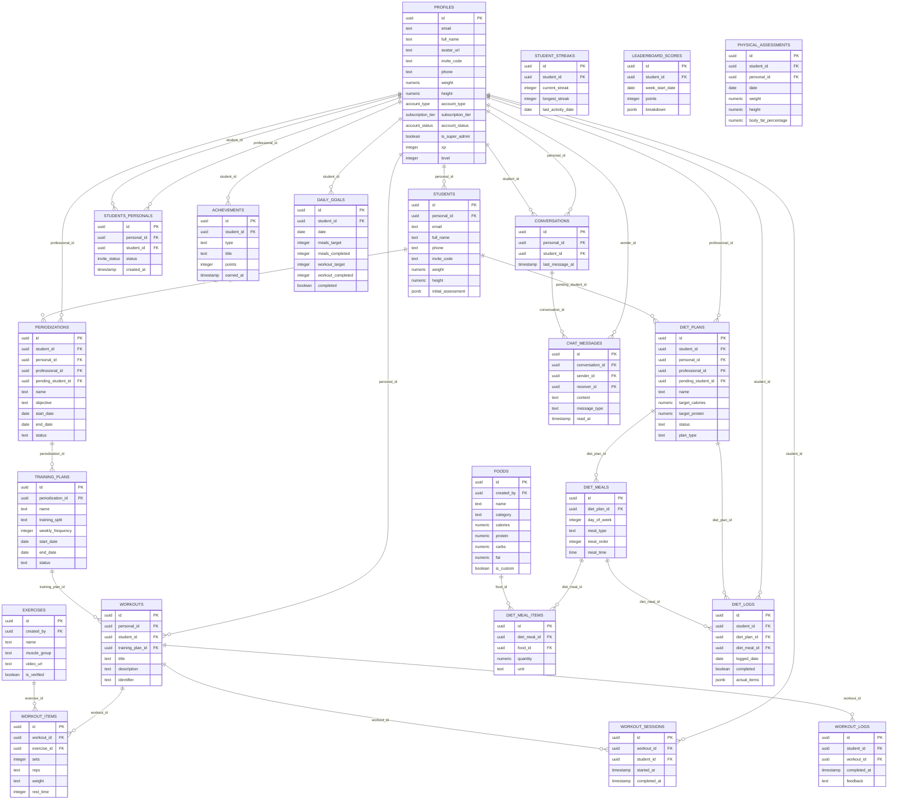

# Arquitetura Completa do Banco de Dados - MeuPersonal

## 📊 Visão Geral

O banco de dados possui **40 tabelas** organizadas em 7 módulos principais:

1. **Autenticação e Perfis** (profiles, students, students_personals)
2. **Treinos e Periodização** (periodizations, training_plans, workouts, exercises)
3. **Nutrição** (diet_plans, diet_meals, foods)
4. **Gamificação** (achievements, daily_goals, leaderboard_scores, student_streaks)
5. **Comunicação** (conversations, chat_messages)
6. **Administração** (admin_audit_logs, system_settings, feature_flags)
7. **Logs e Sessões** (workout_sessions, workout_logs, diet_logs)

---

## 🗺️ Diagrama ER Completo



---

## 📋 Tabelas Detalhadas

### 🔐 Módulo: Autenticação e Perfis

#### PROFILES (Usuários Autenticados)
**Propósito**: Tabela central de todos os usuários autenticados (profissionais e alunos)

**Colunas Principais**:
- `id` (PK): UUID do auth.users
- `account_type`: `professional`, `managed_student`, `autonomous_student`
- `account_status`: `pending`, `active`, `suspended`
- `subscription_tier`: `free`, `basic`, `premium`, `enterprise`
- `xp`, `level`: Sistema de gamificação

**Relacionamentos**:
- É profissional de vários alunos via `students_personals`
- É aluno de vários profissionais via `students_personals`
- Cria periodizações, dietas, treinos
- Participa de conversas

---

#### STUDENTS (Alunos Pendentes - LEGACY)
**Propósito**: ⚠️ **TABELA PROBLEMÁTICA** - Armazena alunos sem auth user

**Colunas Principais**:
- `id` (PK): UUID gerado automaticamente
- `personal_id` (FK): Profissional que criou
- `invite_code`: Código para login
- `full_name`, `phone`, `weight`, `height`

**Problema Identificado**:
- Alunos criados aqui têm ID temporário
- Quando fazem login, novo ID é criado em `profiles`
- Periodizações ficam com ID antigo → não aparecem para o aluno!

**Relacionamentos**:
- `periodizations.pending_student_id` → `students.id`
- `diet_plans.pending_student_id` → `students.id`

---

#### STUDENTS_PERSONALS (Relacionamento Aluno-Profissional)
**Propósito**: Tabela de junção N:M entre alunos e profissionais

**Colunas Principais**:
- `student_id` (FK): `profiles.id` (aluno autenticado)
- `personal_id` (FK): `profiles.id` (profissional)
- `status`: `pending`, `active`, `paused`, `ended`

**Uso Correto**:
- Deve referenciar apenas `profiles.id`
- Não deve ter links para `students.id`

---

### 💪 Módulo: Periodização e Treinos

#### PERIODIZATIONS
**Colunas Principais**:
- `student_id` (FK): `profiles.id` ✅ Correto
- `pending_student_id` (FK): `students.id` ⚠️ Legacy
- `professional_id` (FK): `profiles.id`
- `personal_id` (FK): `profiles.id` (duplicado?)
- `objective`: `hypertrophy`, `strength`, `endurance`, `weight_loss`
- `status`: `planned`, `active`, `completed`

**Problema**:
- Tem DOIS campos para student: `student_id` e `pending_student_id`
- Periodizações antigas usam `pending_student_id`
- Periodizações novas devem usar `student_id`

---

#### TRAINING_PLANS (Fases/Fichas)
**Colunas Principais**:
- `periodization_id` (FK): Periodização pai
- `training_split`: Tipo de divisão (ABC, ABCD, etc)
- `weekly_frequency`: Frequência semanal
- `status`: `draft`, `active`, `completed`

---

#### WORKOUTS (Treinos Individuais)
**Colunas Principais**:
- `training_plan_id` (FK): Ficha pai
- `personal_id` (FK): Criador
- `student_id` (FK): Aluno (opcional)
- `title`: Nome do treino (ex: "Treino A")
- `identifier`: Identificador (A, B, C, etc)

---

#### WORKOUT_ITEMS (Exercícios do Treino)
**Colunas Principais**:
- `workout_id` (FK): Treino pai
- `exercise_id` (FK): Exercício
- `sets`, `reps`, `weight`, `rest_time`
- `order`: Ordem no treino

---

#### EXERCISES (Catálogo de Exercícios)
**Colunas Principais**:
- `name`: Nome do exercício
- `muscle_group`: Grupo muscular
- `video_url`: URL do vídeo demonstrativo
- `created_by` (FK): Criador (se custom)
- `is_verified`: Se foi verificado por admin

---

### 🥗 Módulo: Nutrição

#### DIET_PLANS
**Colunas Principais**:
- `student_id` (FK): `profiles.id` ✅
- `pending_student_id` (FK): `students.id` ⚠️ Legacy
- `professional_id` (FK): `profiles.id`
- `plan_type`: `unique` (mesmo todos os dias) ou `cyclic` (varia por dia)
- `target_calories`, `target_protein`, `target_carbs`, `target_fat`
- `status`: `active`, `inactive`, `completed`

**Mesmo Problema**:
- Também tem `pending_student_id` para alunos legacy

---

#### DIET_MEALS (Refeições)
**Colunas Principais**:
- `diet_plan_id` (FK): Plano pai
- `day_of_week`: -1 (único) ou 0-6 (domingo-sábado)
- `meal_type`: `breakfast`, `lunch`, `dinner`, `snack`
- `meal_order`: Ordem da refeição
- `meal_time`: Horário sugerido

---

#### DIET_MEAL_ITEMS (Alimentos da Refeição)
**Colunas Principais**:
- `diet_meal_id` (FK): Refeição pai
- `food_id` (FK): Alimento
- `quantity`: Quantidade
- `unit`: `g`, `ml`, `un`, `col`, `xic`

---

#### FOODS (Catálogo de Alimentos)
**Colunas Principais**:
- `name`: Nome do alimento
- `category`: Categoria
- `calories`, `protein`, `carbs`, `fat`, `fiber`
- `serving_size`, `serving_unit`
- `is_custom`: Se foi criado por profissional
- `search_vector`: Para busca full-text

---

### 🎮 Módulo: Gamificação

#### ACHIEVEMENTS (Conquistas)
**Colunas Principais**:
- `student_id` (FK): Aluno que conquistou
- `type`: Tipo de conquista
- `title`, `description`, `icon`
- `points`: Pontos ganhos
- `earned_at`: Quando conquistou

---

#### DAILY_GOALS (Metas Diárias)
**Colunas Principais**:
- `student_id` (FK): Aluno
- `date`: Data
- `meals_target`, `meals_completed`
- `workout_target`, `workout_completed`
- `water_target`, `water_completed`
- `sleep_target`, `sleep_completed`
- `completion_percentage`

---

#### STUDENT_STREAKS (Sequências)
**Colunas Principais**:
- `student_id` (FK): Aluno
- `current_streak`: Sequência atual
- `longest_streak`: Maior sequência
- `last_activity_date`: Última atividade

---

#### LEADERBOARD_SCORES (Ranking)
**Colunas Principais**:
- `student_id` (FK): Aluno
- `week_start_date`: Início da semana
- `points`: Pontos totais
- `breakdown`: Detalhamento (JSONB)

---

### 💬 Módulo: Comunicação

#### CONVERSATIONS (Conversas)
**Colunas Principais**:
- `personal_id` (FK): Profissional
- `student_id` (FK): Aluno
- `last_message_at`: Última mensagem

---

#### CHAT_MESSAGES (Mensagens)
**Colunas Principais**:
- `conversation_id` (FK): Conversa
- `sender_id` (FK): Remetente
- `receiver_id` (FK): Destinatário
- `content`: Conteúdo
- `message_type`: `text`, `image`, `video`, `audio`
- `read_at`: Quando foi lida

---

### 📊 Módulo: Logs e Sessões

#### WORKOUT_SESSIONS (Sessões de Treino)
**Colunas Principais**:
- `workout_id` (FK): Treino
- `student_id` (FK): Aluno
- `started_at`: Início
- `completed_at`: Fim

---

#### WORKOUT_LOGS (Logs de Treino)
**Colunas Principais**:
- `student_id` (FK): Aluno
- `workout_id` (FK): Treino
- `completed_at`: Quando completou
- `feedback`: Feedback do aluno

---

#### DIET_LOGS (Logs de Dieta)
**Colunas Principais**:
- `student_id` (FK): Aluno
- `diet_plan_id` (FK): Plano
- `diet_meal_id` (FK): Refeição
- `logged_date`: Data
- `completed`: Se completou
- `actual_items`: Itens reais (JSONB)

---

#### PHYSICAL_ASSESSMENTS (Avaliações Físicas)
**Colunas Principais**:
- `student_id` (FK): Aluno
- `personal_id` (FK): Profissional
- `weight`, `height`
- `neck`, `shoulder`, `chest`, `waist`, `hips`, etc.
- `skinfold_*`: Dobras cutâneas
- `body_fat_percentage`, `bmi`, `bmr`, `tdee`

---

## ⚠️ PROBLEMA IDENTIFICADO: Sistema de Alunos Pendentes

### Fluxo Atual (PROBLEMÁTICO)

```
1. Profissional cria aluno
   ↓
2. Registro em STUDENTS (ID: UUID-A)
   ├─ invite_code: "ABC123"
   └─ personal_id: profissional
   ↓
3. Periodização criada
   ├─ pending_student_id: UUID-A ❌
   └─ student_id: NULL
   ↓
4. Aluno faz login com "ABC123"
   ↓
5. Novo registro em PROFILES (ID: UUID-B) ✅
   ├─ auth user criado
   └─ ID diferente de UUID-A!
   ↓
6. Aluno busca periodizações
   ├─ WHERE student_id = UUID-B
   └─ ❌ NADA ENCONTRADO (periodização tem UUID-A)
```

### Tabelas Afetadas

1. **periodizations**:
   - `pending_student_id` → `students.id` (legacy)
   - `student_id` → `profiles.id` (correto)

2. **diet_plans**:
   - `pending_student_id` → `students.id` (legacy)
   - `student_id` → `profiles.id` (correto)

3. **client_professional_relationships**:
   - `pending_client_id` → `students.id` (legacy)
   - `client_id` → `profiles.id` (correto)

---

## ✅ SOLUÇÃO PROPOSTA

### Fase 1: Criar Alunos com ID Fixo

1. **Função RPC**: `create_student_with_auth`
   - Cria auth user imediatamente
   - Cria registro em `profiles`
   - Cria link em `students_personals`
   - Retorna código de convite

2. **Fluxo Novo**:
```
1. Profissional cria aluno
   ↓
2. create_student_with_auth()
   ├─ Auth user (UUID-FIXO)
   ├─ Profile (UUID-FIXO)
   └─ students_personals link
   ↓
3. Periodização criada
   ├─ student_id: UUID-FIXO ✅
   └─ pending_student_id: NULL
   ↓
4. Aluno faz login
   ├─ Reconhece UUID-FIXO
   └─ ✅ Periodizações aparecem!
```

### Fase 2: Migrar Alunos Existentes

1. Para cada aluno em `students`:
   - Criar auth user
   - Criar profile
   - Atualizar `periodizations.student_id`
   - Atualizar `diet_plans.student_id`
   - Criar link em `students_personals`
   - Deletar registro em `students`

### Fase 3: Limpeza

1. Remover colunas `pending_student_id`
2. Remover tabela `students`
3. Simplificar RLS policies
4. Atualizar documentação

---

## 📊 Estatísticas do Banco

- **Total de Tabelas**: 40
- **Tabelas com FK para profiles**: 30+
- **Tabelas com FK para students (legacy)**: 3
- **Tabelas de logs/sessões**: 8
- **Tabelas de gamificação**: 4
- **Tabelas administrativas**: 5

---

## 🔗 Relacionamentos Críticos

### Aluno → Profissional
- `students_personals` (N:M)
- Permite múltiplos profissionais por aluno
- Permite múltiplos alunos por profissional

### Periodização → Treinos
```
periodizations (1)
  └─ training_plans (N)
      └─ workouts (N)
          └─ workout_items (N)
              └─ exercises (1)
```

### Dieta → Refeições
```
diet_plans (1)
  └─ diet_meals (N)
      └─ diet_meal_items (N)
          └─ foods (1)
```

---

## 🎯 Próximos Passos

1. ✅ Limpar links quebrados em `students_personals`
2. ⏳ Migrar alunos de `students` para `profiles`
3. ⏳ Testar criação de novo aluno
4. ⏳ Verificar se periodizações aparecem
5. ⏳ Remover colunas `pending_student_id`
6. ⏳ Deprecar tabela `students`
