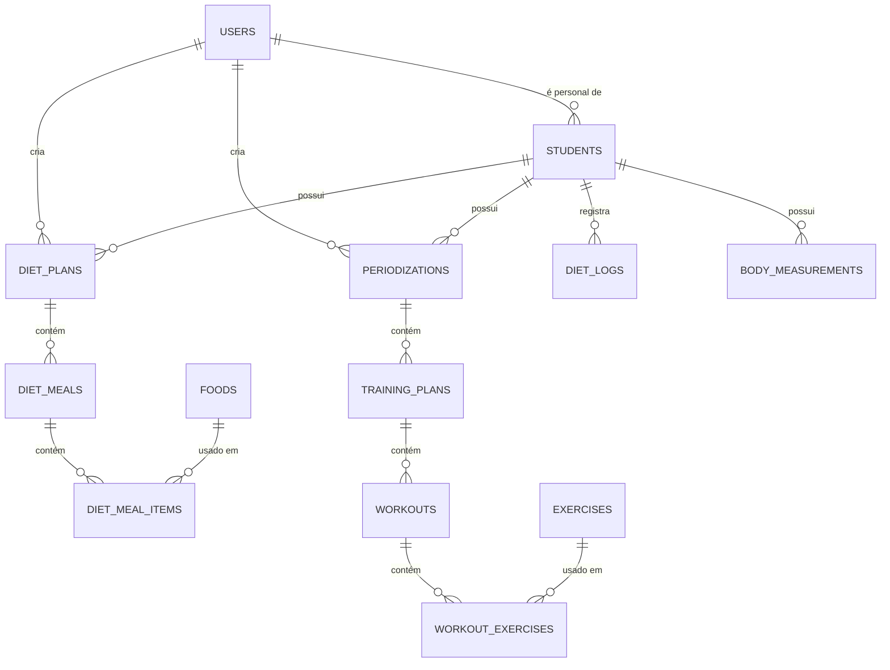
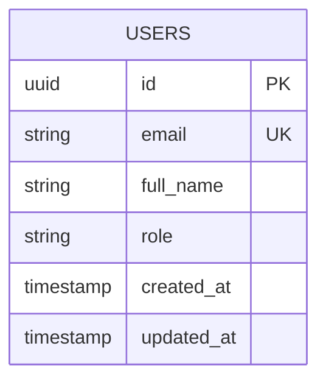
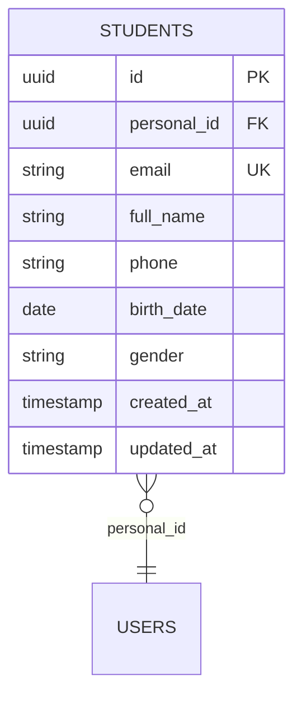
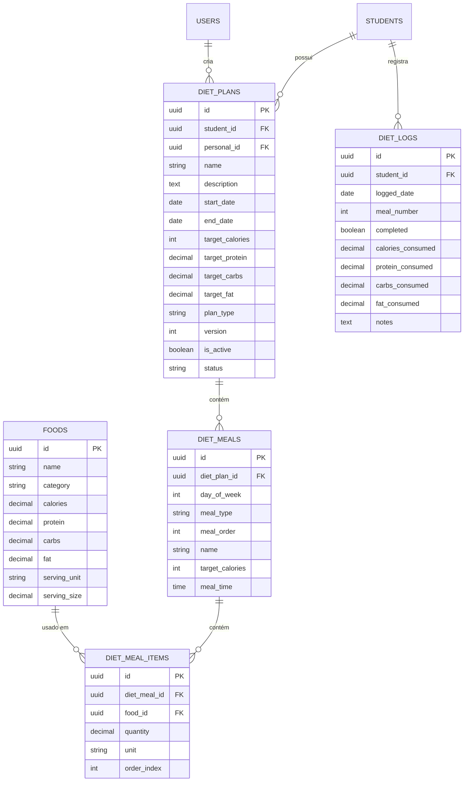
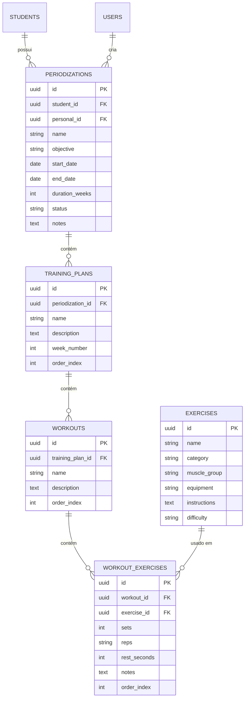
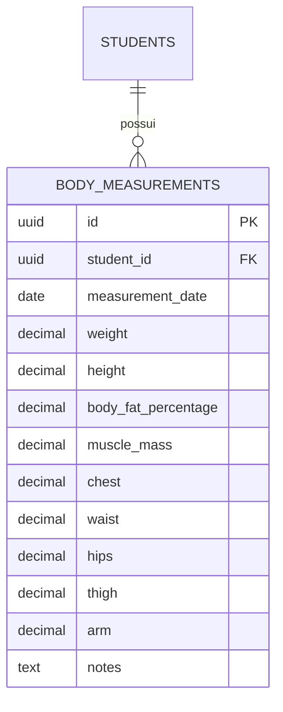

# Database Schema - MeuPersonal

Documentação completa do esquema de banco de dados da aplicação MeuPersonal, incluindo todas as tabelas, relacionamentos e diagramas visuais.

---

## 📊 Visão Geral

O banco de dados é estruturado em 4 módulos principais:
1. **Autenticação e Usuários** (Auth)
2. **Nutrição** (Nutrition)
3. **Treinos e Periodização** (Training)
4. **Dados Corporais** (Body Metrics)

---

## 🗺️ Diagrama Geral - Relacionamentos Principais



---

## 👥 Módulo de Autenticação e Usuários

### Tabela: `users`

Armazena informações dos usuários (Personal Trainers).



**Campos**:
- `id`: Identificador único (UUID)
- `email`: Email do usuário (único)
- `full_name`: Nome completo
- `role`: Papel do usuário (`personal`, `admin`)
- `created_at`: Data de criação
- `updated_at`: Data de atualização

**Relacionamentos**:
- 1:N com `students` (um personal tem vários alunos)
- 1:N com `diet_plans` (um personal cria várias dietas)
- 1:N com `periodizations` (um personal cria várias periodizações)

---

### Tabela: `students`

Armazena informações dos alunos.



**Campos**:
- `id`: Identificador único
- `personal_id`: Referência ao personal trainer
- `email`: Email do aluno (único)
- `full_name`: Nome completo
- `phone`: Telefone
- `birth_date`: Data de nascimento
- `gender`: Gênero (`male`, `female`, `other`)

**Relacionamentos**:
- N:1 com `users` (vários alunos para um personal)
- 1:N com `diet_plans`
- 1:N com `periodizations`
- 1:N com `diet_logs`
- 1:N com `body_measurements`

---

## 🥗 Módulo de Nutrição

### Diagrama Completo - Nutrição



### Tabela: `diet_plans`

Planos de dieta dos alunos.

**Campos Principais**:
- `plan_type`: `unique` (mesmo todos os dias) ou `cyclic` (varia por dia da semana)
- `status`: `active`, `inactive`, `completed`
- `is_active`: Se é o plano ativo atual do aluno
- `version`: Versão do plano (para histórico)

**Regras de Negócio**:
- Apenas 1 plano pode estar `active` por aluno
- `day_of_week`: -1 para plano único, 0-6 para cíclico

---

### Tabela: `diet_meals`

Refeições dentro de um plano de dieta.

**Campos Principais**:
- `day_of_week`: -1 (plano único) ou 0-6 (domingo a sábado)
- `meal_type`: `breakfast`, `lunch`, `dinner`, `snack`, etc.
- `meal_order`: Ordem da refeição no dia
- `meal_time`: Horário sugerido (ex: "07:00")

---

### Tabela: `diet_meal_items`

Alimentos dentro de uma refeição.

**Campos Principais**:
- `quantity`: Quantidade do alimento
- `unit`: Unidade (`g`, `ml`, `un`, `col`, `xic`)
- `order_index`: Ordem do item na refeição

---

### Tabela: `foods`

Catálogo de alimentos.

**Campos Principais**:
- `category`: Categoria do alimento
- Macros por 100g: `calories`, `protein`, `carbs`, `fat`
- `serving_unit` e `serving_size`: Porção padrão

---

### Tabela: `diet_logs`

Registro de refeições completadas pelos alunos.

**Campos Principais**:
- `logged_date`: Data do registro
- `meal_number`: Número da refeição (1-6)
- `completed`: Se foi completada
- Macros consumidos: `calories_consumed`, `protein_consumed`, etc.

---

## 💪 Módulo de Treinos e Periodização

### Diagrama Completo - Treinos



### Tabela: `periodizations`

Periodizações de treino.

**Campos Principais**:
- `objective`: `hypertrophy`, `strength`, `endurance`, `weight_loss`
- `status`: `planned`, `active`, `completed`
- `duration_weeks`: Duração total em semanas

---

### Tabela: `training_plans`

Fichas de treino (fases) dentro de uma periodização.

**Campos Principais**:
- `week_number`: Semana da periodização
- `order_index`: Ordem da ficha

---

### Tabela: `workouts`

Treinos individuais (ex: Treino A, B, C).

**Campos Principais**:
- `name`: Nome do treino (ex: "Treino A - Peito/Tríceps")
- `order_index`: Ordem do treino na ficha

---

### Tabela: `workout_exercises`

Exercícios dentro de um treino.

**Campos Principais**:
- `sets`: Número de séries
- `reps`: Repetições (pode ser range: "8-12")
- `rest_seconds`: Descanso entre séries
- `order_index`: Ordem do exercício

---

### Tabela: `exercises`

Catálogo de exercícios.

**Campos Principais**:
- `category`: `strength`, `cardio`, `flexibility`
- `muscle_group`: Grupo muscular principal
- `equipment`: Equipamento necessário
- `difficulty`: `beginner`, `intermediate`, `advanced`

---

## 📏 Módulo de Medidas Corporais

### Tabela: `body_measurements`

Medidas corporais e evolução dos alunos.



**Campos Principais**:
- `weight`: Peso em kg
- `height`: Altura em cm
- `body_fat_percentage`: Percentual de gordura
- `muscle_mass`: Massa muscular em kg
- Circunferências em cm: `chest`, `waist`, `hips`, `thigh`, `arm`

---

## 🔗 Resumo de Relacionamentos

### Hierarquia Principal

```
USERS (Personal Trainer)
├── STUDENTS (Alunos)
│   ├── DIET_PLANS
│   │   └── DIET_MEALS
│   │       └── DIET_MEAL_ITEMS → FOODS
│   ├── PERIODIZATIONS
│   │   └── TRAINING_PLANS
│   │       └── WORKOUTS
│   │           └── WORKOUT_EXERCISES → EXERCISES
│   ├── DIET_LOGS
│   └── BODY_MEASUREMENTS
```

### Tabelas de Referência (Catálogos)

- `foods`: Catálogo de alimentos
- `exercises`: Catálogo de exercícios

---

## 📋 Convenções e Padrões

### Nomenclatura
- Tabelas: `snake_case` (plural)
- Colunas: `snake_case`
- IDs: `uuid` (v4)
- Foreign Keys: `[tabela]_id`

### Timestamps
Todas as tabelas principais incluem:
- `created_at`: Data de criação
- `updated_at`: Data de atualização

### Status
Padrões de status usados:
- **Diet Plans**: `active`, `inactive`, `completed`
- **Periodizations**: `planned`, `active`, `completed`

### Soft Delete
Não implementado. Exclusões são permanentes.

---

## 🔐 Políticas de Segurança (RLS)

### Row Level Security (Supabase)

Todas as tabelas implementam RLS para garantir que:
- Personals só acessam dados de seus próprios alunos
- Alunos só acessam seus próprios dados
- Catálogos (`foods`, `exercises`) são públicos para leitura

---

## 📊 Índices Importantes

### Performance
- `diet_plans(student_id, is_active)`
- `diet_meals(diet_plan_id, day_of_week)`
- `periodizations(student_id, status)`
- `body_measurements(student_id, measurement_date)`

---

## 🚀 Próximas Expansões

Tabelas planejadas para futuras implementações:
- `notifications`: Sistema de notificações
- `payments`: Controle financeiro
- `messages`: Chat entre personal e aluno
- `workout_logs`: Registro de treinos completados
- `progress_photos`: Fotos de evolução
