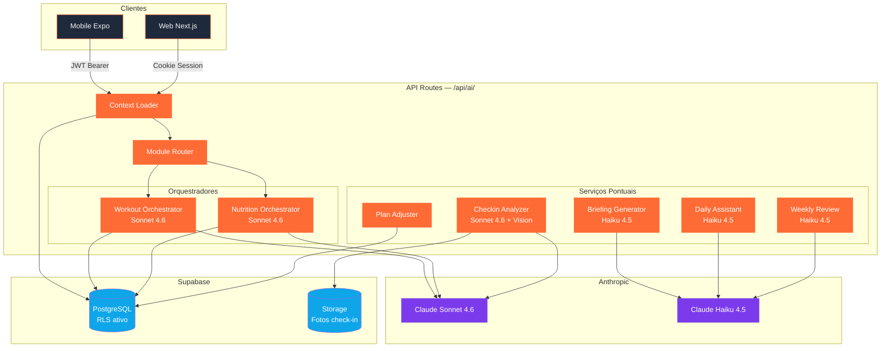
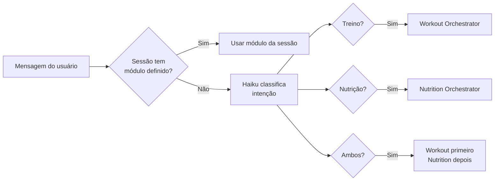
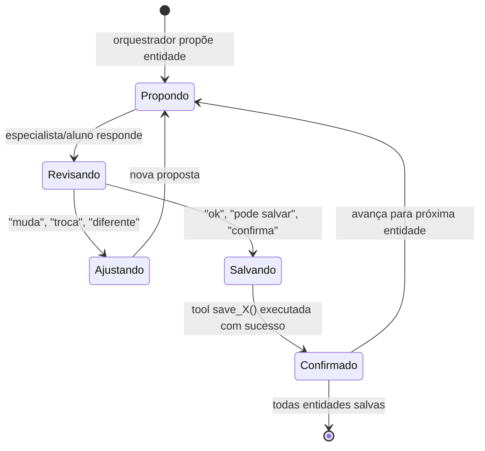
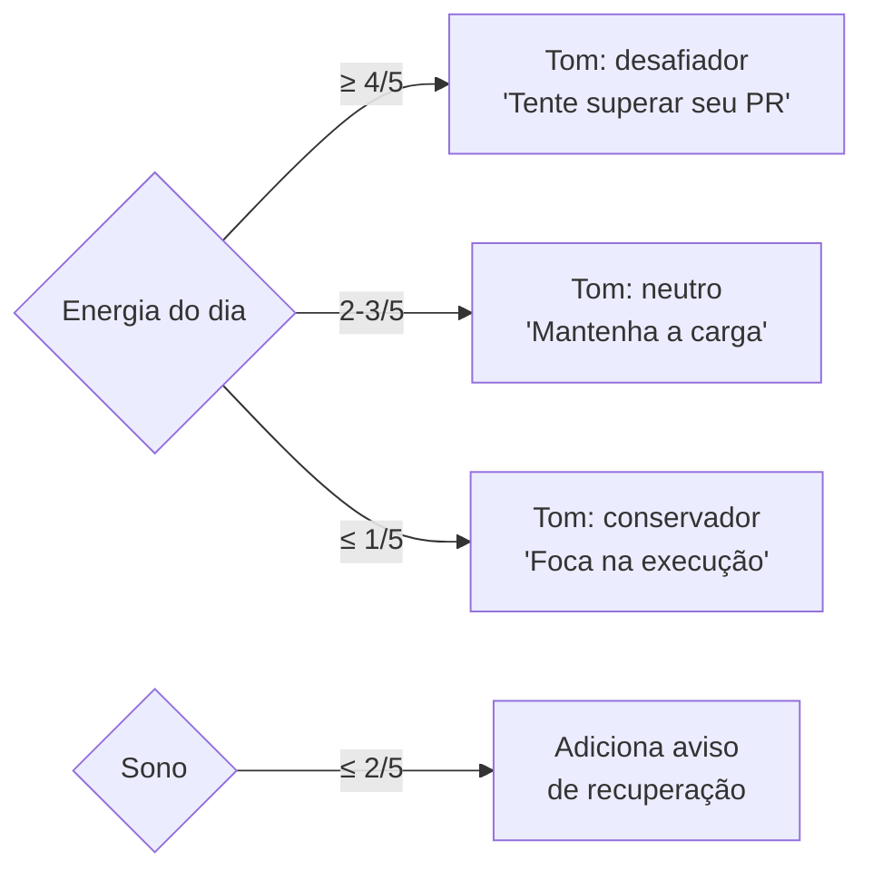
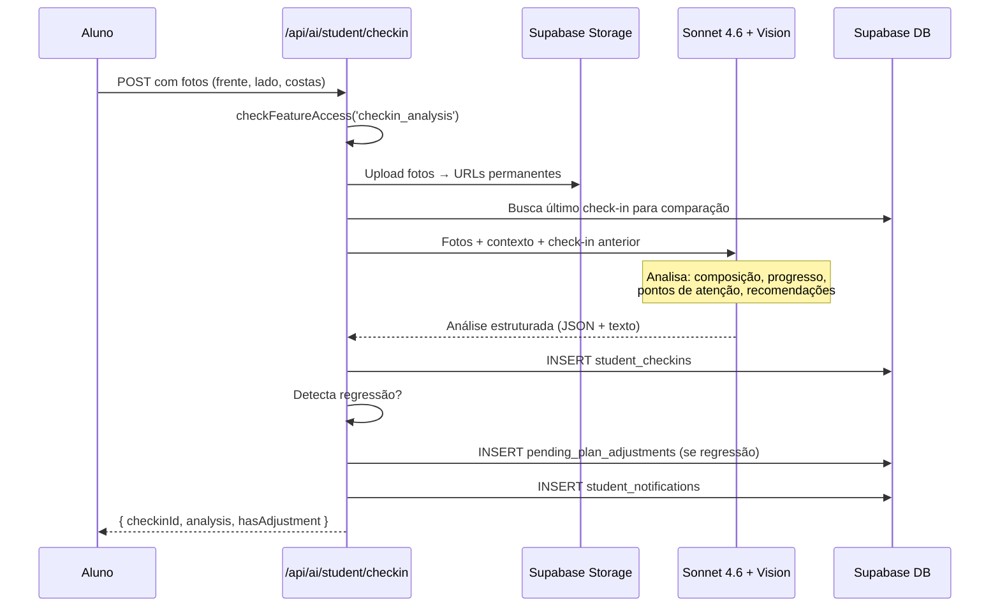
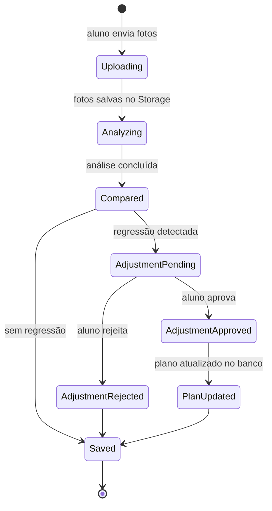
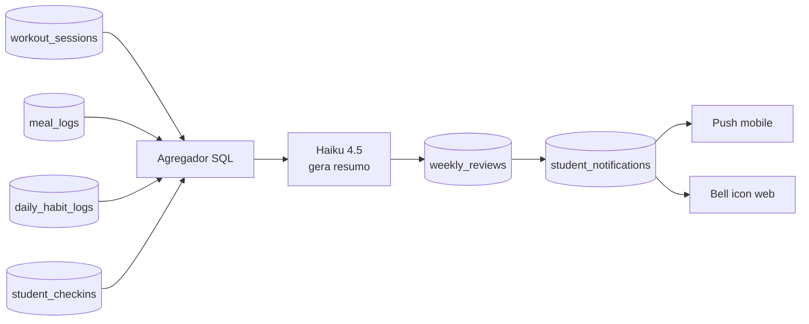

# Módulo AI — Documentação Técnica


> **C4 Nível 3** — Componentes internos do módulo de IA.
> Para a visão geral do sistema: [docs/README.md](../../README.md)
> Para os PRDs deste módulo: [docs/PRDs/ai/README.md](../../PRDs/ai/README.md)

---

## Visão geral do módulo

O módulo de IA é o **BFF de inteligência** do Eleva Pro. Toda chamada à Anthropic API passa por aqui — nunca do mobile diretamente. Expõe endpoints SSE para chat e REST para tarefas pontuais.



---

## C4 Nível 3 — Componentes

### Context Loader
**Responsabilidade:** Agrega o estado completo do aluno antes de qualquer chamada de IA.

**Lê do banco:**
- `periodizations` + `training_plans` + `workouts` + `workout_exercises`
- `diet_plans` + `diet_meals` + `diet_meal_items`
- `student_anamnesis` (objetivos, restrições, lesões, disponibilidade)
- `physical_assessments` (último assessment)
- `daily_habit_logs` (sono, energia — últimos 7 dias)
- `student_checkins` (últimos 3 check-ins)
- `ai_chat_sessions` + `ai_chat_messages` (histórico da conversa)

**Output:** objeto `StudentContext` tipado, pronto para virar prompt cacheado.

**Custo:** zero tokens — é uma query SQL, não uma chamada de IA.

---

### Module Router
**Responsabilidade:** Identifica qual orquestrador acionar com base no histórico da conversa e na mensagem atual.

**Regras de roteamento:**



---

### Workout Orchestrator
**Modelo:** Claude Sonnet 4.6
**Padrão:** Multi-turn com tool use nativo
**Prompt caching:** contexto do aluno cacheado por 5 min (economia de ~85% por sessão)

**Tools disponíveis:**

| Tool | Ação | Tabela destino |
|---|---|---|
| `propose_periodization` | Propõe periodização (sem salvar) | — |
| `propose_phases` | Propõe fases da periodização | — |
| `propose_workouts` | Propõe treinos de uma fase | — |
| `propose_exercises` | Propõe exercícios de um treino | — |
| `save_periodization` | Persiste após confirmação | `periodizations` |
| `save_phase` | Persiste após confirmação | `training_plans` |
| `save_workout` | Persiste após confirmação | `workouts` |
| `save_exercises` | Persiste após confirmação | `workout_exercises` |
| `edit_exercise` | Substitui exercício existente | `workout_exercises` |

**Protocolo de confirmação (regra central):**



---

### Nutrition Orchestrator
**Modelo:** Claude Sonnet 4.6
**Mesmo padrão do Workout Orchestrator**, tools específicas de nutrição:

| Tool | Ação | Tabela destino |
|---|---|---|
| `calculate_macros` | Calcula TDEE + macros alvo | — |
| `propose_diet_plan` | Propõe plano alimentar | — |
| `propose_meals` | Propõe refeições do plano | — |
| `propose_foods` | Propõe alimentos por refeição | — |
| `save_diet_plan` | Persiste após confirmação | `diet_plans` |
| `save_meals` | Persiste após confirmação | `diet_meals` |
| `save_foods` | Persiste após confirmação | `diet_meal_items` |

---

### Briefing Generator
**Modelo:** Claude Haiku 4.5 | **Tipo:** REST (sem streaming) | **SLA:** < 2s

**Input:**
```typescript
{
  workoutId: string,        // treino do dia
  lastSession: WorkoutSession | null,   // última sessão do mesmo tipo
  habitLog: DailyHabitLog | null       // sono e energia do dia
}
```

**Output:**
```typescript
{
  briefing: string,    // 2-3 frases geradas pela IA
  cached: boolean      // se veio do cache de 1h
}
```

**Lógica de tom:**


---

### Daily Assistant
**Modelo:** Claude Haiku 4.5 | **Tipo:** SSE streaming | **Latência alvo:** < 1s até primeiro token

**Contexto enviado (cacheado):**
- Plano atual (treinos + dieta resumidos)
- Últimos 7 dias de habit logs
- Último check-in
- Últimas 10 mensagens da sessão atual

**Limites por plano:**

| Plano | Interações/dia |
|---|---|
| Free | 3 |
| Starter | 10 |
| Pro | Ilimitado |
| Aluno gerenciado | Ilimitado (incluso no plano do especialista) |

---

### Checkin Analyzer
**Modelo:** Claude Sonnet 4.6 + Vision | **Tipo:** REST | **SLA:** < 15s

**Fluxo:**



**Lifecycle do check-in:**



---

### Weekly Review Generator
**Modelo:** Claude Haiku 4.5 | **Tipo:** Cron (domingo 20h) | **Trigger:** Vercel Cron

**Dados agregados para cada aluno:**



---

## Todos os endpoints do módulo

| Endpoint | Método | Tipo | Modelo | Auth |
|---|---|---|---|---|
| `/api/ai/chat/[studentId]` | POST | SSE | Sonnet 4.6 | Especialista |
| `/api/ai/student/onboarding` | POST | SSE | Sonnet 4.6 | Aluno autônomo |
| `/api/ai/student/chat` | POST | SSE | Haiku 4.5 | Aluno qualquer |
| `/api/ai/student/briefing` | GET | REST | Haiku 4.5 | Aluno qualquer |
| `/api/ai/student/checkin` | POST | REST | Sonnet 4.6 + Vision | Aluno qualquer |
| `/api/ai/student/checkin/diff` | GET | REST | — (query SQL) | Aluno qualquer |
| `/api/ai/student/plan/approve` | POST | REST | — (persiste) | Aluno autônomo |
| `/api/ai/report/weekly` | POST | REST | Haiku 4.5 | Cron (interno) |

---

## Custo de IA por usuário/mês

| Serviço | Modelo | Custo estimado |
|---|---|---|
| Assistente diário (30 interações) | Haiku 4.5 | ~R$0,18 |
| Briefing pré-treino (12 treinos) | Haiku 4.5 | ~R$0,06 |
| Review semanal (4x) | Haiku 4.5 | ~R$0,09 |
| Check-in com visão (4 fotos) | Sonnet 4.6 | ~R$0,54 |
| Onboarding — criação de plano (1x) | Sonnet 4.6 | ~R$0,25 |
| **Total mensal (plano Pro intenso)** | | **~R$1,12** |
| **Com prompt caching (−40%)** | | **~R$0,67** |

---

## Regras inegociáveis deste módulo

1. **Nunca chamar Anthropic do mobile** — toda IA passa pelo BFF (`/api/ai/`)
2. **Haiku para tarefas estruturadas, Sonnet para orquestração** — jamais inverter
3. **Prompt caching obrigatório** onde contexto > 1.000 tokens
4. **IA nunca salva sem confirmação explícita** do usuário
5. **SSE para chat, REST para tarefas pontuais** — nunca misturar
6. **Toda sessão salva em `ai_chat_sessions` + `ai_chat_messages`** — sem exceção

---

## Tabelas do banco deste módulo

| Tabela | Operação | RLS |
|---|---|---|
| `ai_chat_sessions` | SELECT, INSERT, UPDATE | Especialista vê suas sessões; aluno vê as suas |
| `ai_chat_messages` | SELECT, INSERT | Via sessão — herda RLS da sessão |
| `student_checkins` | SELECT, INSERT | Aluno vê os seus; especialista vê do aluno vinculado |
| `pending_plan_adjustments` | SELECT, INSERT, UPDATE | Aluno vê os seus apenas |
| `weekly_reviews` | SELECT, INSERT | Aluno vê os seus; especialista vê do aluno vinculado |
| `daily_habit_logs` | SELECT, INSERT | Aluno vê os seus; especialista vê do aluno vinculado |

---

## Links de referência

| Recurso | Link |
|---|---|
| PRD AI Coach Chat (especialista) | [PRDs/ai/ai-coach-chat.md](../../PRDs/ai/ai-coach-chat.md) |
| PRD AI Aluno Autônomo | [PRDs/ai/ai-student-autonomous.md](../../PRDs/ai/ai-student-autonomous.md) |
| PRD Pricing / Gates de plano | [PRDs/ai/ai-pricing.md](../../PRDs/ai/ai-pricing.md) |
| PRD Specialist Engagement | [PRDs/ai/ai-specialist-engagement.md](../../PRDs/ai/ai-specialist-engagement.md) |
| Schema canônico | [SYSTEM_MAPPING.md](../../SYSTEM_MAPPING.md) |
| Branch ativa | `feature/ai-coach-chat` |
