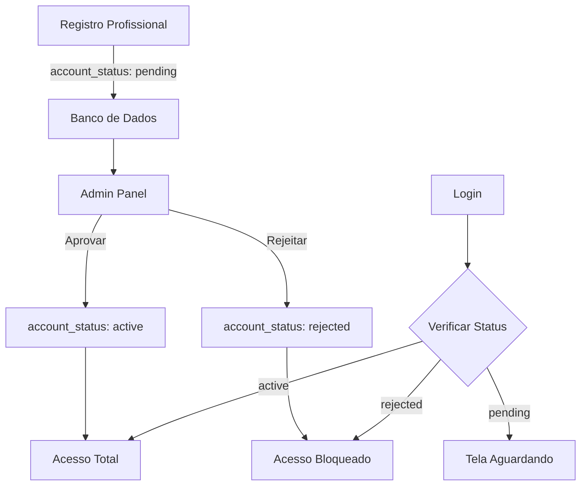

# Sistema de Aprovação de Profissionais

**Versão**: 1.0  
**Data**: 25/11/2025  
**Status**: 🔄 Em Implementação

---

## 📋 Índice

1. [Visão Geral](#visão-geral)
2. [Arquitetura](#arquitetura)
3. [Fluxos de Usuário](#fluxos-de-usuário)
4. [Banco de Dados](#banco-de-dados)
5. [Implementação](#implementação)
6. [Segurança](#segurança)
7. [UX/UI](#uxui)
8. [Testes](#testes)
9. [Melhorias Futuras](#melhorias-futuras)

---

## Visão Geral

### Objetivo

Implementar um sistema de aprovação administrativa para novas contas de profissionais (personal trainers), garantindo controle de qualidade e segurança na plataforma.

### Problema Atual

- Qualquer usuário pode se registrar como profissional
- Acesso imediato sem verificação
- Risco de contas fraudulentas ou não qualificadas

### Solução

Sistema de três estados para contas profissionais:

| Status | Descrição | Acesso |
|--------|-----------|--------|
| `pending` | Aguardando aprovação admin | Bloqueado |
| `active` | Aprovado pelo admin | Total |
| `rejected` | Rejeitado pelo admin | Bloqueado |

---

## Arquitetura

### Componentes



### Camadas

1. **Database Layer**: Coluna `account_status` em `profiles`
2. **Backend Layer**: RLS policies considerando status
3. **API Layer**: Queries e mutations para gerenciar status
4. **UI Layer**: Telas de registro, login, aguardo e admin
5. **State Layer**: Zustand store com lógica de status

---

## Fluxos de Usuário

### 1. Registro de Novo Profissional

```
1. Usuário acessa tela de registro
2. Seleciona tipo "Profissional"
3. Preenche dados (nome, email, senha)
4. Sistema cria conta com account_status: 'pending'
5. Redireciona para tela "Aguardando Aprovação"
6. Mostra mensagem explicativa
```

### 2. Login com Conta Pendente

```
1. Profissional tenta fazer login
2. Autenticação bem-sucedida
3. Sistema verifica account_status
4. Status = 'pending'
5. Redireciona para tela "Aguardando Aprovação"
6. Polling a cada 30s para verificar mudança
```

### 3. Aprovação pelo Admin

```
1. Admin acessa painel administrativo
2. Visualiza lista de profissionais pendentes
3. Revisa informações do profissional
4. Clica em "Aprovar"
5. Sistema atualiza account_status para 'active'
6. Profissional pode fazer login normalmente
```

### 4. Rejeição pelo Admin

```
1. Admin revisa profissional pendente
2. Clica em "Rejeitar"
3. Sistema atualiza account_status para 'rejected'
4. Profissional não consegue mais fazer login
5. Mensagem de erro ao tentar login
```

---

## Banco de Dados

### Schema

```sql
-- Tabela profiles (modificada)
CREATE TABLE profiles (
  id UUID PRIMARY KEY REFERENCES auth.users(id),
  email TEXT NOT NULL,
  full_name TEXT NOT NULL,
  account_type TEXT NOT NULL CHECK (account_type IN ('admin', 'professional', 'managed_student', 'autonomous_student')),
  account_status TEXT NOT NULL DEFAULT 'active' CHECK (account_status IN ('pending', 'active', 'rejected')),
  created_at TIMESTAMPTZ DEFAULT NOW(),
  updated_at TIMESTAMPTZ DEFAULT NOW()
);

-- Índice para performance
CREATE INDEX idx_profiles_account_status 
ON profiles(account_status) 
WHERE account_type = 'professional';
```

### RLS Policies

```sql
-- Profissionais só podem acessar se status = 'active'
CREATE POLICY "Professionals can view own profile" ON profiles
  FOR SELECT
  USING (
    auth.uid() = id 
    AND (account_type != 'professional' OR account_status = 'active')
  );

-- Admins podem ver todos os perfis
CREATE POLICY "Admins can view all profiles" ON profiles
  FOR SELECT
  USING (
    EXISTS (
      SELECT 1 FROM profiles
      WHERE id = auth.uid() AND account_type = 'admin'
    )
  );

-- Admins podem atualizar account_status
CREATE POLICY "Admins can update account_status" ON profiles
  FOR UPDATE
  USING (
    EXISTS (
      SELECT 1 FROM profiles
      WHERE id = auth.uid() AND account_type = 'admin'
    )
  );
```

---

## Implementação

### Web - Admin Panel

**Arquivo**: `apps/web/src/app/admin/components/PendingApprovalsList.tsx`

- ✅ Lista de profissionais pendentes
- ✅ Botões de aprovar/rejeitar
- ✅ UI com feedback visual
- ✅ Integração com TanStack Query

### Web - Auth Flow

**Arquivos**:
- `apps/web/src/app/auth/register/page.tsx` - Define status pending
- `apps/web/src/app/auth/login/page.tsx` - Verifica status
- `apps/web/src/app/auth/pending-approval/page.tsx` - Tela de aguardo

### Mobile - Auth Flow

**Arquivos**:
- `apps/mobile/src/app/(auth)/register.tsx` - Define status pending
- `apps/mobile/src/app/(auth)/login.tsx` - Verifica status
- `apps/mobile/src/app/(auth)/pending-approval.tsx` - Tela de aguardo

### Shared Types

**Arquivo**: `packages/supabase/src/types.ts`

```typescript
export type AccountStatus = 'pending' | 'active' | 'rejected';

export interface Profile {
  id: string;
  email: string;
  full_name: string;
  account_type: AccountType;
  account_status: AccountStatus;
  created_at: string;
  updated_at: string;
}
```

---

## Segurança

### Considerações

1. **RLS Enforcement**: Todas as queries respeitam RLS policies
2. **Admin-Only Actions**: Apenas admins podem alterar `account_status`
3. **No Client-Side Bypass**: Status verificado no servidor
4. **Audit Trail**: Logs de aprovação/rejeição (futuro)

### Proteções

- ✅ RLS policies impedem acesso de contas pendentes/rejeitadas
- ✅ Verificação de status em cada login
- ✅ Redirecionamento automático se status mudar
- ✅ Impossível alterar próprio status via client

---

## UX/UI

### Tela de Aguardando Aprovação

**Elementos**:
- 🎨 Ícone de relógio/ampulheta
- 📝 Mensagem clara explicando o processo
- ⏱️ Indicação de tempo estimado (se aplicável)
- 🔄 Indicador de verificação automática
- 🚪 Botão de logout
- 📧 Informação de contato para dúvidas

**Mensagem Sugerida**:
```
Sua conta está em análise! 🔍

Obrigado por se cadastrar como profissional na nossa plataforma.
Sua solicitação está sendo analisada pela nossa equipe.

Você receberá uma notificação assim que sua conta for aprovada.
Tempo estimado: até 24 horas.

Verificando status automaticamente...
```

### Admin Panel

**Elementos**:
- 📊 Contador de pendências no dashboard
- 📋 Lista ordenada por data (mais recentes primeiro)
- 👤 Avatar e informações do profissional
- ⏰ Data da solicitação
- ✅ Botão verde "Aprovar"
- ❌ Botão vermelho "Rejeitar"
- 🔔 Badge de notificação se houver novas solicitações

---

## Testes

### Casos de Teste

#### 1. Registro
- [ ] Registrar como profissional define status `pending`
- [ ] Redirecionamento correto para tela de aguardo
- [ ] Registro de aluno não é afetado (status `active`)

#### 2. Login
- [ ] Login com conta `pending` redireciona para aguardo
- [ ] Login com conta `rejected` mostra erro
- [ ] Login com conta `active` funciona normalmente

#### 3. Aprovação
- [ ] Admin consegue aprovar profissional
- [ ] Status muda para `active` no banco
- [ ] Profissional consegue fazer login após aprovação

#### 4. Rejeição
- [ ] Admin consegue rejeitar profissional
- [ ] Status muda para `rejected` no banco
- [ ] Profissional não consegue fazer login

#### 5. Polling
- [ ] Tela de aguardo verifica status periodicamente
- [ ] Redirecionamento automático quando aprovado
- [ ] Mensagem de erro quando rejeitado

#### 6. Cross-Platform
- [ ] Comportamento consistente entre web e mobile
- [ ] UI apropriada para cada plataforma

---

## Melhorias Futuras

### Fase 2 - Notificações

- [ ] Email quando conta é aprovada
- [ ] Email quando conta é rejeitada
- [ ] Push notification para mobile
- [ ] Notificação para admin quando novo profissional se registra

### Fase 3 - Informações Adicionais

- [ ] Profissional envia documentos (CREF, certificados)
- [ ] Upload de foto de perfil durante registro
- [ ] Formulário expandido com mais informações
- [ ] Área de especialização

### Fase 4 - Analytics

- [ ] Tempo médio de aprovação
- [ ] Taxa de aprovação vs rejeição
- [ ] Gráficos de solicitações por período
- [ ] Dashboard de métricas para admins

### Fase 5 - Automação

- [ ] Verificação automática de CREF (API)
- [ ] IA para análise de documentos
- [ ] Auto-aprovação para casos óbvios
- [ ] Sistema de pontuação de confiança

---

## Referências

- [Supabase RLS](https://supabase.com/docs/guides/auth/row-level-security)
- [TanStack Query](https://tanstack.com/query/latest)
- [Expo Router](https://docs.expo.dev/router/introduction/)
- [Next.js App Router](https://nextjs.org/docs/app)

---

**Última Atualização**: 25/11/2025  
**Responsável**: Daniel Levi  
**Status**: Em Implementação
